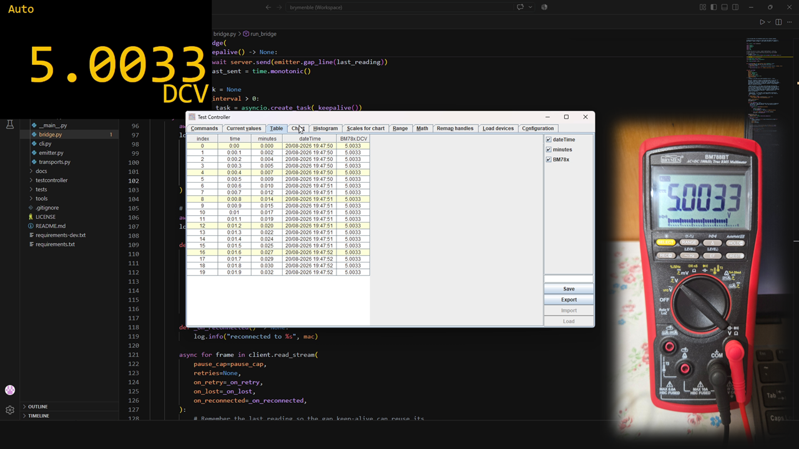

# brymenble SDK

> **⚠️ Unofficial.** This is an independent, community-developed project. It is
> **not affiliated with, endorsed by, or sponsored by** Brymen Technology Corporation. "Brymen" and the device model names are trademarks of their
> respective owners.



Open-source Python SDK for **Brymen BM78xBT** Bluetooth Low Energy wireless multimeters. This is the monorepo for both the SDK itself (`src/brymenble/`) and
its example apps (`examples/`): a live-readings console and a raw-protocol
debug tool.

## Related projects

The SDK is used by two companion projects in the same family:

- [**brymenble-overlay**](https://github.com/milksplash/brymenble-overlay) — emulates readings from the multimeter as an overlay
  for OBS (or any browser), driven live by this SDK over BLE.
- [**brymenble-tc-bridge**](https://github.com/milksplash/brymenble-tc-bridge) — re-emits the SDK's parsed readings over a TCP
  socket so [**TestController**](https://lygte-info.dk/project/TestControllerIntro%20UK.html)
(lygte-info.dk's freeware multi-device test & logging tool). can be used to log the meter.


## SDK

The SDK is a pip-installable package that handles the whole protocol:

- `brymenble.constants` — protocol constants and lookup tables
- `brymenble.crc` — CRC-16 (poly 0xA001) used by the protocol
- `brymenble.commands` — building command packets (auth, etc.)
- `brymenble.parsers` — turning raw packets/frames into `InfoPacket`, `ReadingPacket`, `RtcTime`
- `brymenble.formatter` — converting a parsed reading into a display string (`"123.45 V"`)
- `brymenble.console` — shared console output helpers (`ts()`, `status()`, `reading_line()`, `state()`, and lifecycle/status callbacks `retry` / `paused` / `lost` / `reconnected` / `scanning` / `using` / `found` / `connecting` / `connected` / `disconnected`) so every consumer prints identically
- `brymenble.transport` — `BrymenbleClient`: connect, authenticate, subscribe, stream parsed frames, plus a retry/reconnect policy (`ensure_connected`), a high-level streaming loop (`read_stream`) that waits out function-switch pauses and reconnects on a real link drop, and idempotent `close()`

### Documentation

- `docs/SDK_DATA_REFERENCE.md` — reference of every parsed field the SDK exposes (`ReadingPacket`, `InfoPacket`, `RtcTime`, `CommandResponse`)

### Install

From PyPI (recommended):

```bash
pip install brymenble
```

From a source checkout (for development or unreleased changes):

```bash
pip install -e .          # from the repo root (installs `brymenble` + `bleak`)
```

Directly from GitHub (no PyPI needed):

```bash
pip install git+https://github.com/milksplash/brymenble.git
```

### Minimal use

```python
import asyncio
from brymenble import BrymenbleClient, DEFAULT_PASSWORD, find_meters, format_reading

async def main():
    meters = await find_meters()
    if not meters:
        print("No BM78xBT meters found.")
        return
    mac = meters[0].address

    async with BrymenbleClient(mac, DEFAULT_PASSWORD, sync_rtc_on_connect=True) as client:
        async for frame in client:
            print(frame.info.mac_str, format_reading(frame.readings[0]))

asyncio.run(main())
```

`find_first_meter()` is the same discovery wrapped in a retry loop for
long-running apps — it scans until a meter is found (retrying every
`retry_interval` seconds, calling `on_retry(attempt)` before each re-scan).
Pass `retry_interval=0` for a single-shot scan that returns `None` when
nothing is found.

### Long-running consumers

For apps that must survive the meter powering off (overlays, loggers),
`BrymenbleClient.read_stream()` is a self-healing loop: a data gap while the
BLE link is up is treated as a function-switch pause and waited out, while a
real link drop is confirmed and transparently reconnected. Optional
`on_pause` / `on_lost` / `on_reconnected` callbacks report lifecycle
changes; `retries=None` reconnects forever.

```python
async for frame in client.read_stream(retries=None):
    print(frame.info.mac_str, format_reading(frame.readings[0]))
```

> **One connection per meter.** BLE is point-to-point — a BM78xBT accepts a
> single connection, so a second instance (or any other app) cannot connect
> while another holds it; it just looks like "out of range". If a connect
> fails/times out, the error and a one-time warning include a hint to check
> the meter isn't connected elsewhere. Stop the other app before retrying.

## Example apps

- **`examples/live.py`** — a thin program built on the SDK: it connects to a
  meter and prints its readings as they arrive, using the shared
  `brymenble.console` helpers so the output matches the overlay and the TC
  bridge. With no MAC given it scans for the first BM78xBT meter it finds.

  ```bash
  python examples/live.py [MAC] [PASSWORD]
  ```

- **`examples/debug_stream.py`** — a debug/test script that dumps the raw
  protocol stream via `examples/display.py`: the full raw frame hex, the
  device-info packet, each reading packet, and packet-timing statistics. Use
  it to inspect exactly what the meter sends (the clean console view above is
  `examples/live.py`).

  ```bash
  python examples/debug_stream.py [MAC] [PASSWORD]
  ```

For on-demand reads and hardware probing, see `tools/probe.py` (exercises the
command/response layer against a real meter) and `tools/capture.py` (records
real frames for the test fixtures).

## Platform support

Linux and Windows are supported. macOS randomizes BLE device MAC addresses and behavior is not tested.

## Tests

Offline tests:

```bash
.venv\Scripts\python.exe -m pytest
```

`tools/capture.py` captures real frames from a meter into
`tests/fixtures/captures.json`.

## License

MIT — see [LICENSE](LICENSE).

"Brymen" and the device model names are trademarks of their respective owners;
this project is not affiliated with or endorsed by Brymen Technology Corporation.